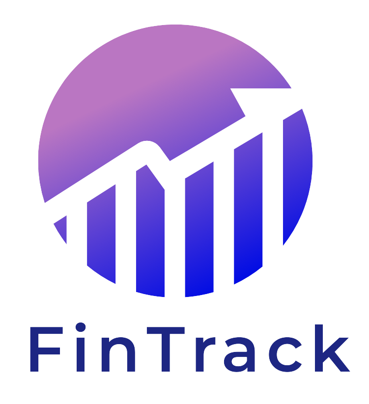

# 🌟 FinTrack - Budget Management System

Welcome to **FinTrack**, a sleek and intuitive budget management system designed to help individuals track their income, expenses, and savings effortlessly. With a modern design, dynamic financial tools, and interactive visuals, FinTrack aims to transform the way you manage your personal finances.  

  
*Visualize your financial future with FinTrack*

---

## ✨ Features

- **🌐 Responsive Design**: Accessible on desktop, tablet, and mobile with a user-friendly interface.
- **📅 Dynamic Financial Calendars**: Easily track daily, weekly, or monthly financial activities.
- **📊 Interactive Charts & Graphs**: Visualize your income, expenses, and savings through customizable charts powered by Chart.js.
- **🎯 Personalized Budget Planning**: Tailor your budget goals based on your income, spending habits, and financial targets.
- **📖 Financial Insights**: Gain real-time insights into spending trends and income patterns to make better financial decisions.
- **🌈 Dark Mode & Light Mode**: Toggle between dark and light modes to suit your preferences.

## 🎨 Creative Features

- **💸 Spend Categorization**: Automatically categorize your expenses into predefined categories like Food, Transport, Bills, Entertainment, etc., and see a breakdown of how you spend your money.
- **🏆 Financial Goals & Achievements**: Set goals like “Save 5000 Rs in a month” or “Spend less than 500 Rs on food weekly,” and earn badges and achievements for reaching them.
- **📱 Progressive Web App (PWA)**: Install FinTrack on your phone or desktop for an app-like experience.
- **🚀 Quick Entry via Widgets**: Use home screen widgets (for mobile) to quickly add expenses or view daily financial stats.
- **📌 Real-time Notifications**: Receive alerts when you’re approaching your budget limit or have important financial tasks.

## 🚀 Getting Started

1. **Clone the repository**:
git clone https://github.com/ash250604/Minor-Project-7th-Sem.git
Navigate to the project directory:
cd Minor-Project-7th-Sem
Install dependencies:
npm install
Start the server:
npm start
Access the app: Open your browser and visit http://localhost:3000.

